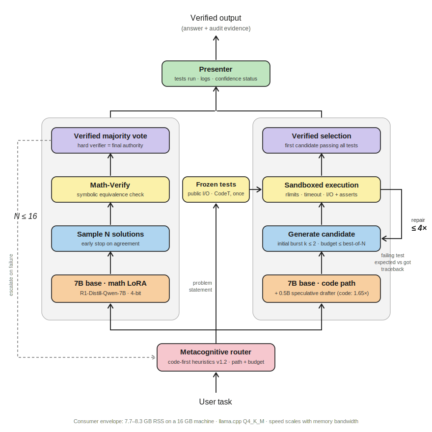

# Horizon: a verification-first layer for local LLMs

*Horizon is a research project by the team behind [vexp](https://vexp.dev),
the local-first context engine for AI coding.*

**The model is not the product; the layer around it is.** Horizon turns an
open-weight model running on a 16 GB consumer machine into a *verified* STEM
and coding system: **a metacognitive router + an execution harness with hard
verifiers** (sandboxed test execution, symbolic math checking), best-of-N
selection, and an **agentic repair loop** for code. Every answer ships with
its evidence (tests generated, executed, passed, logged).

The practical payoff: **capable, auditable coding that runs fully offline on
a 16 GB machine.** On tasks where correctness is checkable, verification is
what recovers the capability: a 7B reaches parity with its own 671B teacher
(and, on a newer base, passes it) on LiveCodeBench, at 13.3 tok/s on a
mainstream desktop. This is a claim about *verifiable* tasks (code with
tests, checkable math), not general-purpose coding; the honest scope is
stated throughout, not buried.

Two design commitments drive everything here:

1. **Hard verifiers hold final authority.** Neural judges were tested and
   rejected (two documented null results). If it didn't execute, it isn't
   verified.
2. **Base-agnostic by construction.** The layer is training-free at inference
   and re-applies to any open base; as open models improve, the system
   improves for free. (Measured on two further model families; see the
   replication table below.)

Everything was measured against two ceilings via API: **DeepSeek R1 671B**
(the base's own "teacher") and **DeepSeek V4 Flash** (frontier reference).
All comparisons are apples-to-apples: same problems, same scoring, isolated
baselines, decontaminated training data.

## Measured results (July 2026, 100 problems per benchmark)

What the layer adds to the same bare 7B base, and where that lands:

| Benchmark | Bare base 7B | **+ Horizon layer** | **Δ layer** | Teacher 671B | V4 Flash |
|---|---|---|---|---|---|
| GSM8K | 85.0 | **95.0** | +10.0 | 96.0 | 99.0 |
| MATH-500 | 85.0 | **92.0** | +7.0 | 97.0 | 98.0 |
| HumanEval | 79.0 | **99.0** | **+20.0** | 94.0 | 96.0 |
| MBPP | 72.0 | **92.0** | **+20.0** | 93.0 | 93.0 |
| LiveCodeBench (post-cutoff window) | 25.0 | **44.0** | **+19.0** | 46.0 | 69.0 |
| AIME 2024 | 43.3 | **53.3** | +10.0 | 66.7 | 80.0 |
| MMLU-STEM | 89.3 | **90.0** | +0.7 | n.m. | 96.0 |
| **Mean (6 core)** | **64.9** | **79.2** | **+14.3** | **82.1** | **89.2** |

The honest read: **the layer is worth +14.3 points on average (+19/20 where
code executes against tests), bringing a 7B to near-parity with its 671B
teacher on 4 of 6 benchmarks (±3–4 statistical noise at n=100) and past both
ceilings where hard verifiers exist (HumanEval 99). The olympiad-math gap is
model capacity, not harness**; see the RLVR roadmap. Fine-tuned domain
specialists measured ~neutral; we publish that too, because it is the point:
the value lives in verification, not in the weights.

Highlight: the **agentic repair loop** (generate → run frozen tests → feed the
concrete failure back → retry, adaptive budget) scores **44.0 on LiveCodeBench
vs 38.0 for best-of-8 at −38% tokens** (34.8k vs 56.4k per problem). Sequential
search with objective feedback beats blind parallel sampling, and it keeps a
single trace in RAM, which is exactly what a consumer machine needs.

With the full system in front of the same loop (router v1.2 + specialists +
repair) LiveCodeBench lands at **42.0**, inside the ±3–4 noise band of the
router-free repair path. Measured twice, the router adds no tax; and on
competitive-programming code the value concentrates in verify-and-repair,
not in the weights. We publish both numbers.

Quantization check: the full pipeline on CPU (llama.cpp, Q4_K_M) loses ~1
problem per benchmark vs bf16: the consumer story holds.

## Replication on other base families (July 2026, pre-registered)

To test that the value lives in the layer and not in one lucky base, we froze
the harness, swapped the base model and re-ran the same paired protocol
(naked → +layer, same benchmarks, n=100), **pre-registered before the runs**
in [`experiments/A2_preregistration.md`](experiments/A2_preregistration.md)
(endpoint: mean paired delta ≥ +8 on both families):

| Benchmark | Qwen3-8B naked | +layer | Δ | Ministral-8B naked | +layer | Δ |
|---|---|---|---|---|---|---|
| GSM8K | 98.0 | 98.0 | +0.0 | 86.0 | 90.0 | +4.0 |
| MATH-500 | 92.0 | 93.0 | +1.0 | 61.0 | 70.0 | +9.0 |
| HumanEval | 57.0 | 99.0 | +42.0 | 85.0 | 100.0 | +15.0 |
| MBPP | 45.0 | 96.0 | +51.0 | 68.0 | 79.0 | +11.0 |
| LiveCodeBench (+repair) | 33.0 | 51.0 | +18.0 | 15.0 | 21.0 | +6.0 |
| **Mean Δ** | | | **+22.4** | | | **+9.0** |

The honest read, in full: part of the Qwen3 HumanEval/MBPP delta is the
harness repairing output *formatting* (robust extraction), not only
correctness. The cleanest transfer signal is LiveCodeBench, where extraction
was never the issue. On Qwen3 the layered system reaches **51 on
LiveCodeBench, above the same layer on the reference base (44) and above
the 671B teacher (46)**: swap the base and the system improves for free. On
the deliberately weak, non-reasoning base (Ministral) the layer clears the
pre-registered bar within noise (+9.0 vs ≥ +8): verification amplifies what
the base can produce; it does not conjure capability. The replication also
exposed a real portability defect (strict chat templates reject consecutive
user messages). It was fixed and fully re-run; the invalid runs are quarantined in
[`results/invalid/`](results/invalid/), not deleted.

## Consumer speed, measured (July 2026)

Generation speed for the 7B (Q4_K_M, llama.cpp, 12 threads) on a mainstream
desktop: Ryzen 9 3900X, dual-channel DDR4 (sysbench write bandwidth 32 GB/s
declared; the read figure is L3-inflated and not used). Speculative decoding
uses our **tiny drafter**: Qwen2.5-0.5B, full-finetuned for ~$3 on 30k R1
traces with the target's tokenizer, so it drops into `llama.cpp -md` with an
exactly matching vocabulary.

| Config | Code generation | Reasoning segment | RSS |
|---|---|---|---|
| 7B autoregressive | 8.1 t/s | 8.1 t/s | 7.7 GB |
| + drafter 0.5B (γ=8) | **10.7-15.1 t/s (mean 13.3, 1.65×)** | 7.1-9.4 (neutral) | 8.3 GB |
| + family 1.5B draft (γ=12) | 7.1-10.9 (mean 8.4, no gain) | 5.3 (hurts) | 9.4 GB |

Acceptance rates (three coding tasks): drafter 36-56% on code, 20-30% on
reasoning text. The honest read:

- **The cheap-draft principle holds.** The 1.5B family draft reaches similar
  acceptance but its own forward cost eats the entire gain on CPU; the 0.5B
  drafter keeps the gain. On bandwidth-bound hardware the draft must be
  nearly free, not merely accurate.
- **Speculation pays on code, not on reasoning.** Acceptance collapses on
  chain-of-thought text. The product policy that follows: enable speculation
  per segment (off while the model thinks, on while it writes code).
- A stock 0.5B cannot even pair with the target under the strict vocabulary
  check (and scored τ≈1 through the permissive server path on the laptop):
  the target-tokenizer training is what makes the drafter a drop-in.
- Worst-case floor: the same stack on a thermally-throttled laptop
  (3-5 GB/s measured bandwidth) generates at 0.6-0.7 t/s. Speed scales with
  memory bandwidth; the architecture is unchanged.
- Toolchain note: recent `llama.cpp` defaults `--spec-type` to `none`, so
  passing `-md` alone loads the draft model but does not speculate (no
  warning). Use the dedicated `llama-speculative` binary (what the numbers
  above use), or pass `--spec-type draft-simple` to `llama-server`. Check
  that acceptance stats are non-zero to confirm speculation is active.

Raw session logs: `results/vast_session/`.

`§N` references in the code are indexed in
[`docs/METHODOLOGY.md`](docs/METHODOLOGY.md), the public reference for data,
decontamination, baselines protocol, scoring, gate criteria and honesty rules.

## Architecture



- **Router** (`router/`): deterministic code heuristics first (v1.2, includes
  competitive-programming markers), then an embedding classifier. Measured
  fix: v1.1 misrouted 59/100 LiveCodeBench problems to the math path
  (full system collapsed to 12.2); v1.2 re-run: **0/100 misrouted, full
  system at 39.0 vs 38.0 for the router-free configuration**: the router
  now costs nothing on out-of-distribution prompt styles. Confirmed with the
  repair loop on top: 42.0 (full system) vs 44.0 (router-free), both inside
  the noise band.
- **Harness** (`harness/pipeline.py`): one `Pipeline` class; every baseline is
  a flag configuration of the same code (no parallel implementations to trust).
- **Hard verifiers hold final authority**: sandboxed execution for code,
  Math-Verify for math. Neural judges (two PRMs tested) did not beat plain
  self-consistency and are OFF by default, a documented null result.
- **Repair loop** (`harness/repair_loop.py`): three design rules: tests are
  frozen before the loop, feedback is objective only (tracebacks, expected vs
  got), total budget ≤ best-of-N budget.

## Structure

```
config/    base config + LoRA hyperparameters     harness/   pipeline + verifiers + repair loop + presenter
common/    config, model client, benchmark loaders eval/      baselines, runner, ceilings, tables
data/      prepare + decontaminate                 results/   master_table, hardware_table, runs/
train/     train_lora (Unsloth/TRL)                report/    gate_decision
serve/     vLLM (GPU tier) + llama.cpp (CPU floor) router/    heuristics + v0 embedding + v1 classifier
```

## Setup

```bash
python -m venv .venv && source .venv/bin/activate
pip install -r requirements.txt
# optional, preferred for training: pip install unsloth
cp .env.example .env        # put your OPENROUTER_API_KEY in .env (NEVER in .env.example)
```

Before serious runs, check the lines marked `VERIFY` in `config/` and
`common/benchmarks.py` (model/dataset IDs and library versions drift).

## Reproducing the results

Raw per-problem result JSONs for every run in the tables live in
`results/runs/` (tracked in git). Heavy sampling artifacts (raw generations,
PRM step scores; `*.jsonl` files) are published separately as release assets.

```bash
# 1. Data: download + decontaminate + filter (per specialist)
for s in math code science; do python -m data.prepare --specialist $s; done

# 2. Train the three LoRA adapters (one 24 GB GPU, ~$12 total on a rented 4090)
for s in math code science; do python -m train.train_lora --specialist $s; done

# 3. Serve (multi-LoRA)
python -m serve.vllm_server            # base + 3 adapters on :8000

# 4. Run the baselines (the heart of the method: isolate every contribution)
for b in 1_base_naked 2_base_specialist 3_base_verifier 3b_verifier_repair 4_full_system; do
  python -m eval.run_benchmarks --baseline $b --benchmarks math500 gsm8k humaneval mbpp livecodebench aime2024 mmlu_stem
done

# 5. Ceilings via OpenRouter (~$5 total)
python -m eval.deepseek_ceiling --benchmarks math500 livecodebench aime2024 --ceiling both --mode single

# 6. Tables
python -m eval.build_tables            # -> results/master_table.md + report/gate_decision.md
```

CPU floor (consumer validation): `python -m serve.llamacpp_floor convert|serve`
(llama.cpp, Q4_K_M, ≤8 GB RSS on a 16 GB machine; 8.3 GB with the
speculative drafter loaded).

## The baselines (anti-fooling protocol)

| id | description | pieces on |
|---|---|---|
| `1_base_naked` | bare base, single-shot | — |
| `2_base_specialist` | base + one specialist | LoRA |
| `3_base_verifier` | base + verification + best-of-N | verifier |
| `3b_verifier_repair` | base + agentic repair loop (code) | verifier + repair |
| `4_full_system` | router + specialists + verification | everything |
| `4b_full_system_repair` | full system with repair on code | everything + repair |
| `5_deepseek_single` / `6_deepseek_boN` | V4 Flash single / +best-of-N (API) | frontier ceiling |
| `5r1_single` / `6r1_boN` | R1 671B single / +best-of-N (API) | teacher ceiling |

The verifier helps *any* model. That is why baselines 3 and 6 exist: the
architecture must beat its own pieces, not just the bare base.

## Honesty rules

- Training data decontaminated against every eval benchmark (exact + n-gram).
- LiveCodeBench restricted to a post-training-cutoff window (dates ≥ 2024-08-01).
- Internal selection uses **public tests only**; hidden tests are used
  exclusively for scoring. The repair loop iterates on public tests only.
- Generated code runs **only in a sandbox** (subprocess rlimit+timeout by
  default; `export HORIZON_SANDBOX=docker` for hardened runs).
- Negative results are reported (PRM selection: two models tested, both ≤
  self-consistency; SC flat from N=8 to N=32 while oracle rises to 97).
- Secrets live in `.env` (gitignored), never in code or `.env.example`.

## License

[MIT](LICENSE).
